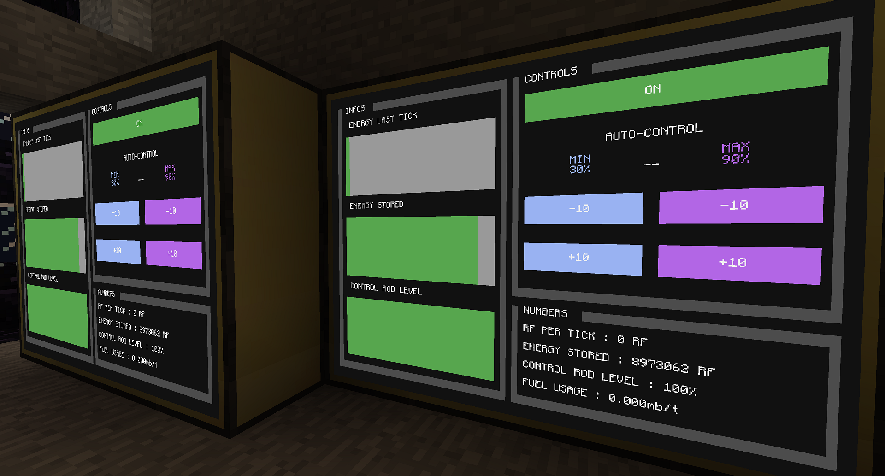

# Reactor Controller

Modified from [Reactor Madness Program](https://pastebin.com/NY6MU58s), this program automates reactor management.

Modifications:
- Support for multiple monitors on a network (must be the same dimensions)
- Re-draw GUI every 5 seconds to work around data persistence error from chunk unloading
- Fixed GUI spacing

